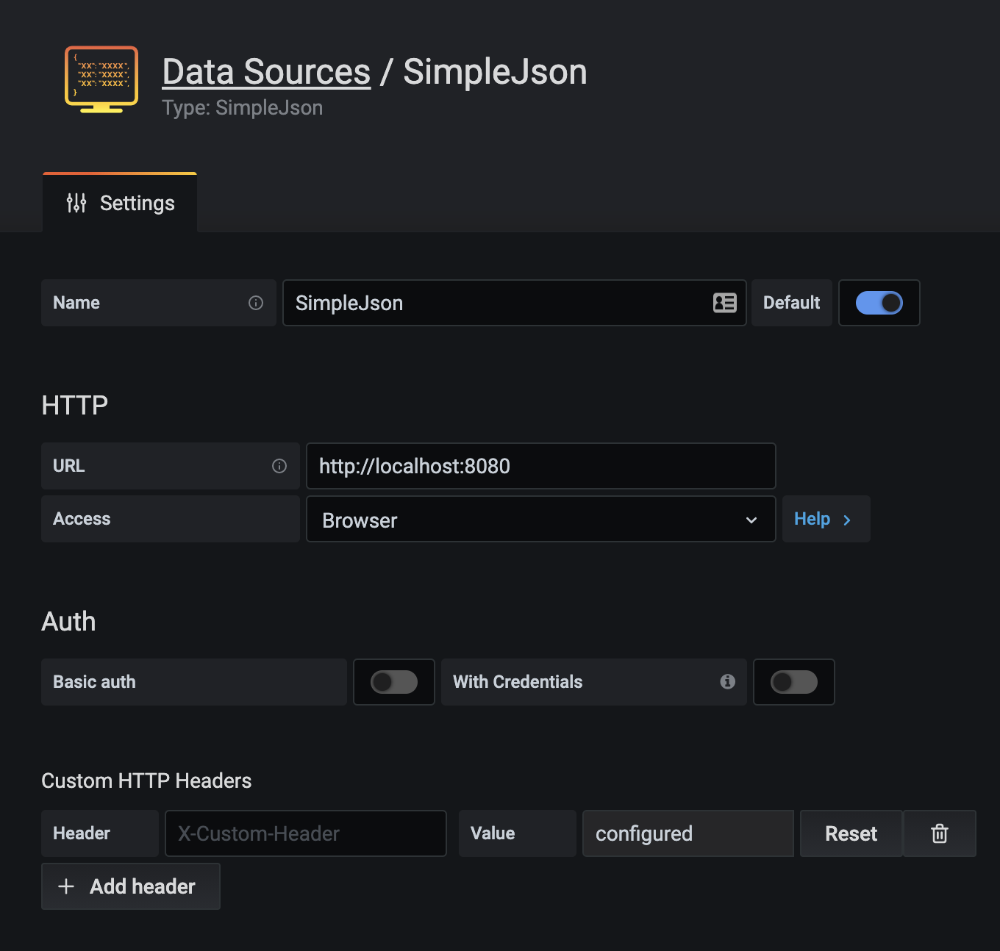

# homey-grafana

A nodejs bridge to view Homey's insights logs in Grafana, without any additional data storage required

The integration with grafana is based on the [Simple JSON plugin](https://grafana.com/grafana/plugins/grafana-simple-json-datasource).
This can be found in the plugin section of your Grafana instance ([Simple JSON datasource plugin documentation](https://grafana.com/grafana/plugins/grafana-simple-json-datasource/)
). 

# Quickstart 
Prerequisites:
 
- nodejs installed
- homey present on the same network

Start the api that integrates with Homey:
```bash
$ npm ci
$ homey login # to allow the homey dependency to access your homey
$ node app.ts
```
The api will start and is ready to be used from grafana. Per default port 8080 is used and you can start creating your first dashboard


An example dashboard can be found in [example_dashboard.json](example_dashboard.json) 

## Setting up grafana
If you don't have a grafana instance running, you can start one following their docs. You can [download and install](https://grafana.com/grafana/download)
an instance or set up a docker container (simplest command: `docker run -d --name=grafana -p 3000:3000 grafana/grafana`)

In Grafana you'd wanna add a datasource of type `SimpleJson`.  
When configuring SimpleJson make sure to set the `Access` field to 'Browser', specifically when dealing with Docker



## 🐋 Run `homey-grafana` with docker 
You can also run `homey-grafana`, both the API and grafana (with necessary plugins) with docker:

Ensure the nodejs app can use the .athom-cli credentials 


```bash 
$ make build
$ make run-all
```
You'll probably notice an error the first time, because the `athom-cli` setting could not be found. 
This is due to the limited access given to `homey-grafana` in the Docker container. To populate the settings,
use the following command:

```bash
$ cat ~/.athom-cli/settings.json >> ./settings/settings2.json 
```

(if issues persist, remove the `./settings/settings.json` file and try again) 


Now you can navigate to `http://localhost:3000` to view grafana and start setting it up. Note that 
there is a linked volume pointing to `./data`.

## 🐋 Docker, without grafana
To run without grafana, and use docker command directly:

```bash
$ docker build -t zzave/homey-grafana:latest .
$ docker run --rm -d \
        --name homey-grafana \
        -v ${PWD}/settings:/root/.athom-cli \
        -p8080:8080 \
        zzave/homey-grafana:latest
```

The api is available on port `8080`


# The plugin

[Simple JSON datasource plugin documentation](https://grafana.com/grafana/plugins/grafana-simple-json-datasource/)

# Developer's guidelines

## Extending functionality
I'm open for extending homey-grafana! Feel free to put in a pull request or start an issue.

The functions in homey-grafana are setup already in an extensible manner, allowing for easy addition. Take a look 
at the [AliasFunction](./src/functions/AliasFunction.js) for inspiration

## Releasing / Publishing homey-grafana

To deploy the latest docker container to docker hub, for several architecture:

```bash
docker buildx build --platform linux/amd64,linux/arm64,linux/arm/v7 -t zzave/homey-grafana:latest --push . 
```

current set of architecture include standard architectures used on most servers and personal devices afaik, and I've explicitly included ARMv7 for raspberry pi support

- To publish on github, use the github ui
- To publish to npm simply hit `npm publish`. Use `npm version` to update the version in `package.json`
 
